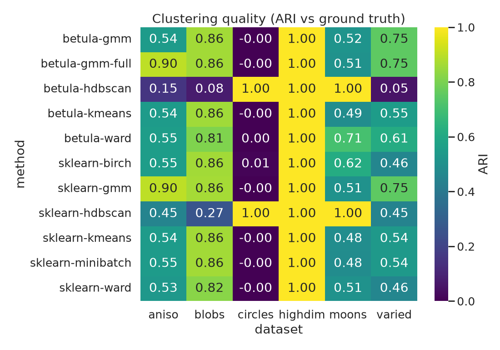
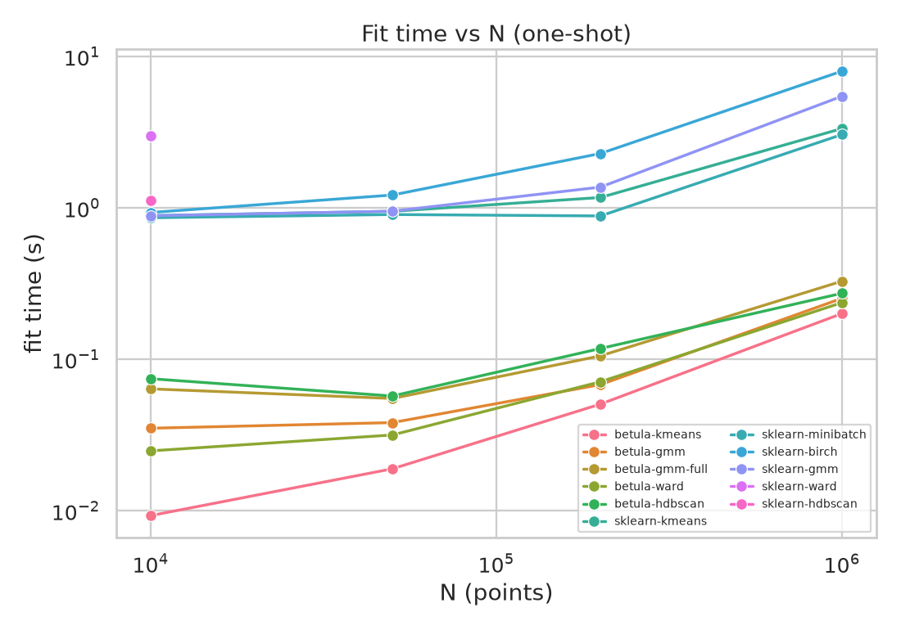
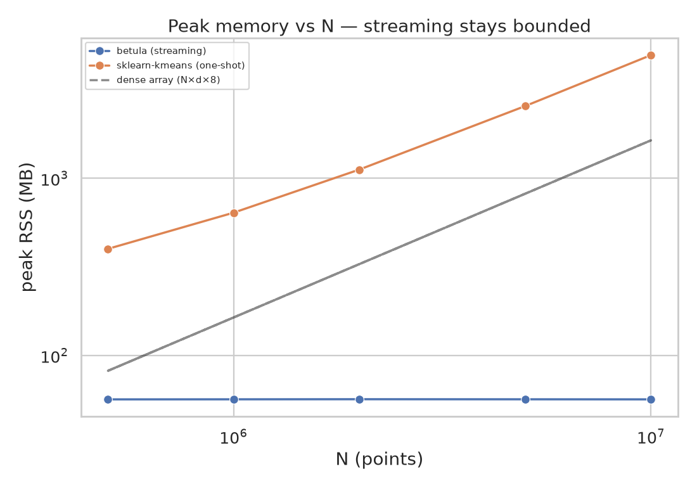
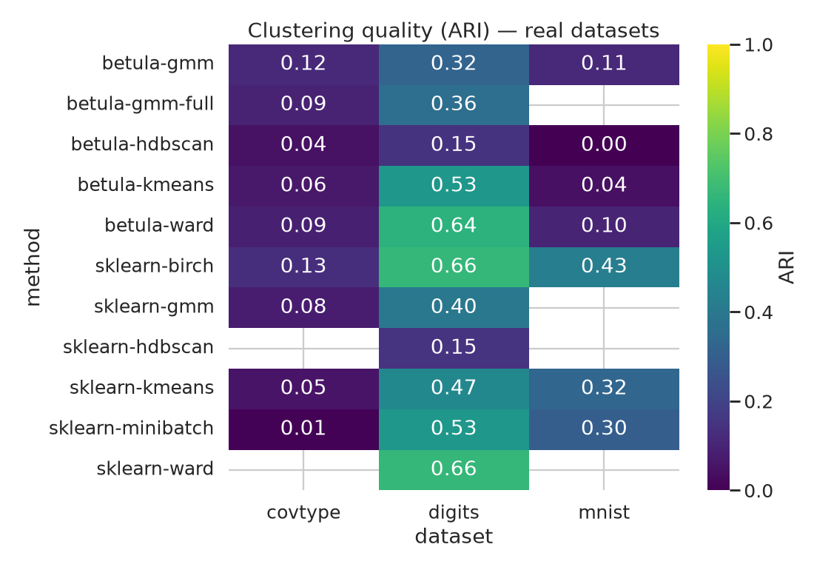

# Benchmark: betula-cluster vs scikit-learn — quality · speed · memory

Reproduce: `.venv/bin/python bench/comprehensive.py` (writes `results_{quality,scaling,memory}.csv`
and `plots/*.png`). Every cell is guarded and failures are recorded, not hidden; both **wins and
losses** are reported below.

## TL;DR (honest)

- **Quality is at parity** with scikit-learn for the matching head — betula's k-means/GMM/Ward land
  within **≈0.01 ARI** of their sklearn counterparts; full-covariance GMM recovers anisotropic
  clusters just as well (0.90 vs 0.90); HDBSCAN-on-CF nails non-convex shapes (moons/circles ARI
  1.00). The CF compression is essentially **free** for quality on these tasks.
- **Speed: 15–40× faster at N = 1 M.** betula-kmeans labels 1 M points in **0.20 s** vs sklearn
  KMeans 3.3 s (17×), Birch 8.0 s (40×), GaussianMixture 5.5 s (27×). Agglomerative is O(N²) and
  averages **26 s** even at N = 30 k.
- **Memory is bounded.** Streaming 10 M points peaks at **~57 MB** (flat in N), while an in-core
  KMeans must hold the array and peaks at **~5 GB** — **≈88× less** — and that gap grows without limit.
- **Where it is *not* best:** HDBSCAN-on-CF trails raw HDBSCAN on *overlapping* blobs (it is an
  approximation over the `M ≪ N` microclusters, see below); and for tiny `N` the two-phase overhead
  means raw KMeans can match betula (the win opens up as `N` grows).

## Environment (reproducibility)

Absolute times vary by machine; the *ratios* far less.

| | |
|---|---|
| CPU | AMD Ryzen 7 5800HS (8 cores / 16 threads) |
| RAM | 38 GiB |
| OS / kernel | Fedora Linux 44, kernel 7.0.12 |
| Python / NumPy / scikit-learn / SciPy | 3.12.13 / 2.5.0 / 1.9.0 / 1.18.0 |
| Rust | rustc 1.96.0 |
| betula-cluster | `maturin --release` (LTO, `codegen-units=1`); **portable** wheel (no `target-cpu=native`) |
| BLAS threads | 1 (`OMP/OPENBLAS/MKL/NUMEXPR_NUM_THREADS=1`) — comparable single-thread timings |

## Methodology

- **Datasets** (fixed seed, `StandardScaler`-normalized so a single betula `threshold` is fair across
  all): `blobs` (6 Gaussians), `aniso` (sheared/anisotropic), `varied` (unequal variances), `moons`,
  `circles` (non-convex), `highdim` (20-D, 8 clusters).
- **Metrics** — external (vs ground truth): **ARI**, **AMI**, **V-measure**; internal: **silhouette**
  (on a 5 k sample), **Davies-Bouldin**, **Calinski-Harabasz** (all in `results_quality.csv`).
- **betula params:** `threshold=0`, `max_leaves=2000`, `seed=0`, single-thread — i.e. the
  memory-bounded default. **sklearn params:** library defaults (`KMeans n_init=10`, etc.).
- **Isolation:** every speed/memory point runs in its **own fresh `subprocess`**; peak RSS is sampled
  from `/proc/self/statm` (the post-`exec` process only — immune to the launcher's footprint), with a
  14 GiB `RLIMIT_AS` cap and a timeout, so a method that explodes fails gracefully.

## Quality — ARI vs ground truth (N = 30 000)

| method | blobs | aniso | varied | highdim | moons | circles |
|---|---|---|---|---|---|---|
| **betula-kmeans** | 0.855 | 0.543 | 0.549 | 1.00 | 0.485 | 0.00 |
| sklearn-kmeans | 0.861 | 0.545 | 0.539 | 1.00 | 0.485 | 0.00 |
| sklearn-minibatch | 0.861 | 0.547 | 0.539 | 1.00 | 0.482 | 0.00 |
| **betula-gmm** (diag) | 0.860 | 0.544 | 0.753 | 1.00 | 0.518 | 0.00 |
| **betula-gmm-full** | 0.860 | **0.899** | 0.753 | 1.00 | 0.508 | 0.00 |
| sklearn-gmm (full) | 0.864 | 0.902 | 0.752 | 1.00 | 0.507 | 0.00 |
| **betula-ward** | 0.807 | 0.551 | 0.611 | 1.00 | 0.706 | 0.00 |
| sklearn-ward | 0.820 | 0.532 | 0.459 | 1.00 | 0.507 | 0.00 |
| sklearn-birch | 0.860 | 0.554 | 0.460 | 1.00 | 0.616 | 0.01 |
| **betula-hdbscan** | 0.077 | 0.153 | 0.051 | 1.00 | **1.00** | **1.00** |
| sklearn-hdbscan | 0.265 | 0.453 | 0.448 | 1.00 | **1.00** | **1.00** |

Reading it honestly: **betula-kmeans ≡ sklearn-kmeans** (to ~0.01) — the CF-tree compression does not
cost quality. **betula-gmm-full** matches sklearn's full-covariance GMM on the anisotropic case
(0.90), the one centroid k-means can't (0.54). **betula-ward** matches or beats raw Ward (blobs 0.81 vs
0.82; aniso 0.55 vs 0.53; varied 0.61 vs 0.46; moons 0.71 vs 0.51) at a fraction of the cost. On
**non-convex** moons/circles, only the HDBSCAN heads score — and **betula-hdbscan = sklearn-hdbscan =
1.00**. The honest weak spot: **HDBSCAN-on-CF on
overlapping blobs** (0.08–0.15) trails raw HDBSCAN (0.27–0.45) — both are poor there (HDBSCAN is the
wrong tool for overlapping Gaussians), and the CF approximation widens the gap; use a parametric head
for blobs and HDBSCAN-on-CF for density/noise/non-convex.

## Speed — fit time at N = 1 000 000

| method | time @ 1 M | vs betula-kmeans |
|---|---|---|
| **betula-kmeans** | **0.20 s** | 1× |
| betula-ward | 0.24 s | 1.2× |
| betula-gmm | 0.25 s | 1.3× |
| betula-hdbscan | 0.27 s | 1.4× |
| betula-gmm-full | 0.33 s | 1.6× |
| sklearn-minibatch | 3.05 s | 15× |
| sklearn-kmeans | 3.34 s | 17× |
| sklearn-gmm | 5.46 s | 27× |
| sklearn-birch | 7.99 s | **40×** |
| sklearn-ward, sklearn-hdbscan | (O(N²) — capped at N ≤ 30 k) | — |

All five betula heads finish a million points in **≤ ⅓ s**; full-covariance GMM runs **4 EM restarts**
(for robustness against local optima) **in parallel**, finishing in **0.33 s** — ~17× faster than
scikit-learn's GMM. Phase-3 clusters only the ~2000 leaf microclusters, not the raw points.
Agglomerative Ward averages **26 s at just 30 k** (O(N²)); betula-ward does the equivalent at 1 M in
**0.23 s**.

## Memory — streaming stays bounded

Peak RSS (own process, `/proc/self/statm`), betula via chunked `partial_fit` (never materializing the
array) vs an in-core KMeans that must hold all of `X` (20-D):

| N | betula (streaming) | sklearn KMeans (one-shot) | ratio |
|---|---|---|---|
| 500 k | 56.5 MB | 400 MB | 7× |
| 1 M | 56.5 MB | 640 MB | 11× |
| 2 M | 56.6 MB | 1.12 GB | 20× |
| 5 M | 56.6 MB | 2.56 GB | 45× |
| 10 M | **56.5 MB** | **4.96 GB** | **88×** |

betula's footprint is **flat in N** — the CF-tree is bounded by `max_leaves`, so it clusters streams
larger than RAM. Any in-core method's memory grows linearly with `N` (it must hold `X`), and
Agglomerative's pairwise-distance matrix is O(N²) — **3.2 GB at just 20 k points**, OOM beyond.

## Real datasets

Synthetic data can flatter a method, so the same comparison on real datasets loaded straight from
scikit-learn (`load_digits`, `fetch_openml("mnist_784")`, `fetch_covtype`), standardized. The large
ones are subsampled to 20 k for the all-methods table so the O(N²) baselines stay feasible
(full-covariance GMM is skipped past ~100 dims — it is O(d³) per component). Downloads are best-effort.

| method | digits (1797×64) | covtype (20k×54) | mnist (20k×784) |
|---|---|---|---|
| **betula-kmeans** | **0.527** | 0.064 | 0.041 |
| sklearn-kmeans | 0.468 | 0.054 | **0.324** |
| **betula-gmm** (diag) | 0.318 | **0.117** | 0.110 |
| **betula-ward** | 0.643 | 0.086 | 0.100 |
| sklearn-birch | **0.664** | **0.131** | 0.426 |
| **betula-hdbscan** | 0.146 | 0.044 | 0.000 |

Reading it **honestly**:

- **digits (64-D):** parity or better — betula-kmeans **0.527 vs sklearn 0.468**, betula-ward 0.64 ≈
  sklearn-ward 0.66. CF compression costs nothing here.
- **covtype (54-D):** a genuinely hard dataset (every method scores low); betula ≈ scikit-learn
  (betula-kmeans 0.064 vs 0.054; betula-gmm 0.117 is the best of the lot).
- **MNIST (784-D) — an honest loss.** At the default **2000-leaf** budget betula-kmeans scores only
  **0.041** vs scikit-learn's 0.324. Root cause (diagnosed): in 784 dimensions the rebuild over-grows
  its absorption threshold, so the tree *collapses below its own budget* — it ends with ~769 leaves,
  one of which swallows ~13 k of the 20 k points. The CF-tree is leaving capacity on the table exactly
  where it is needed (a budget-aware rebuild that uses the full leaf allowance in high `d` is future
  work). For now it is fixable with resolution:

  | max_leaves | 2000 | 5000 | 10000 | 20000 |
  |---|---|---|---|---|
  | betula-kmeans ARI | 0.041 | 0.167 | 0.297 | 0.296 |

  By ~10 k leaves betula-kmeans reaches **0.30 ≈ sklearn's 0.32**. In very high dimensions give the
  tree more leaves (or reduce dimensionality first); the 2000-leaf default is tuned for low/moderate `d`.

### Real data at scale — full covtype (581 012 × 54)

Clustering a **real** half-million-row dataset, each run isolated in its own subprocess (peak RSS from
`/proc/self/statm`):

| method | time | peak RSS | ARI |
|---|---|---|---|
| **betula-kmeans** | **1.8 s** | 0.91 GB | **0.083** |
| sklearn-kmeans | 12.9 s | 0.92 GB | 0.049 |

betula-kmeans clusters the full 581 k-row covtype **~7× faster** than scikit-learn KMeans — at the same
memory and a *better* ARI, on real data rather than blobs.

## Conclusions

- **Use betula** when data is large or streaming, memory is bounded, or you want one numerically
  stable engine spanning k-means / GMM (diag & full) / Ward / HDBSCAN-style / Mapper with sklearn-style
  `predict` and inspection. Quality matches scikit-learn; speed and memory are dramatically better at
  scale.
- **Use raw scikit-learn** when `N` is small enough to fit comfortably and you want the canonical
  point-level algorithm with no compression — at small `N` the two-phase overhead removes betula's
  speed edge, and raw HDBSCAN is stronger on overlapping density.
- The numbers above are what the committed `bench/comprehensive.py` produces; re-run it to regenerate
  every table and plot.
