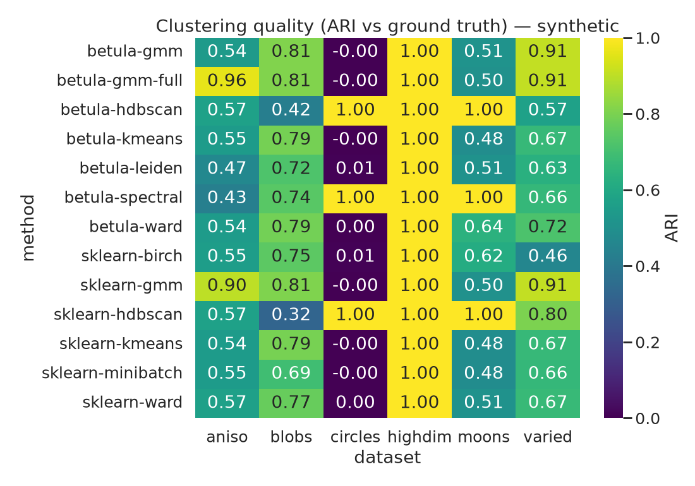
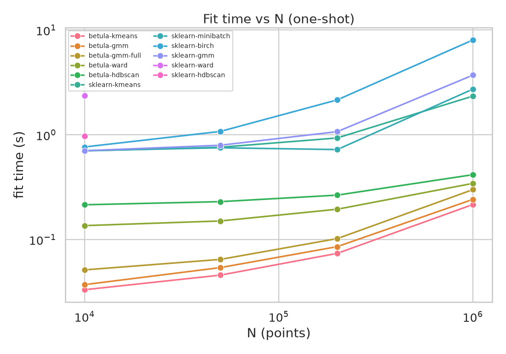
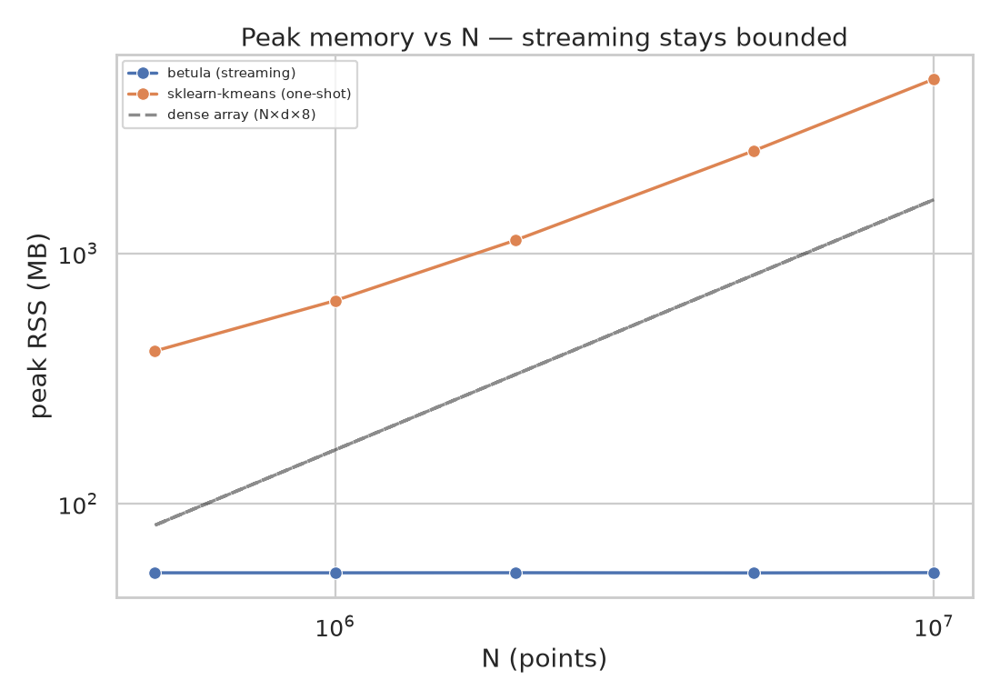
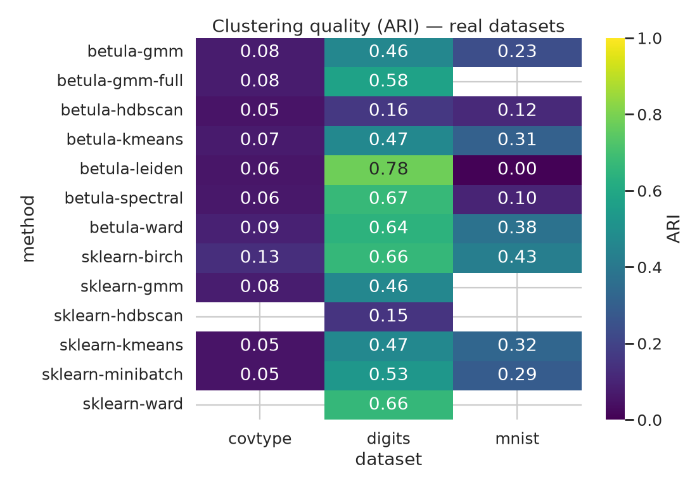

# Benchmark: betula-cluster vs scikit-learn — quality · speed · memory

> **Provenance — read before quoting a number.** Re-measured **2026-08-24** against the working tree
> after 0.7.0. Every quality table is the **median of seeds 0, 1, 2**, and
> each ships its own
> min/median/max sidecar (`results_*_spread.csv`); the speed, memory, scale and sparse tables are a
> single run, since `bench/_worker.py` pins `seed=0` for them and they are seed-invariant by
> construction. The previous edition of this page was a single run of 2026-07-18 against a **0.2.0**
> build; every number on it has been replaced, several of them downwards. This page is re-measured as
> a whole, not patched cell by cell.
>
> This edition re-ran every table after the CF k-means++ sampling weight gained the leaf's own scatter
> term (Lang Eq. 5.4, `S_i + n_i·D²_i`; see the changelog's `[Unreleased]`). Cell-by-cell against the
> previous run, **only the seeded heads moved** — `kmeans`, `gmm`, `gmm-full` and `spectral`, plus the
> two sparse rows that cluster with `method="kmeans"`. `ward`, `leiden`, `hdbscan` and every
> scikit-learn row reproduced to the last digit, which is what makes the deltas attributable to that
> one change. The synthetic tables did not move at all: at `N = 30 000` under `max_leaves=4000` the
> quality suite is not where the term bites, and `digits` at `max_leaves=1797` holds one point per leaf,
> so `S_i = 0` and the change is provably a no-op there.
>
> The previous edition re-ran the quality tables after the `min_samples` convention change (the head now
> counts the microcluster itself, matching `sklearn.cluster.HDBSCAN`). No table here
> exercises `method="vmf"` (verified by grep over every `results_*.csv`), so 0.7.0's vMF
> concentration-cap fix moves nothing on this page.

Reproduce: `python bench/comprehensive.py --quality-only --seed S --tag _sS` for S ∈ {1, 2}, then
`python bench/comprehensive.py --seed 0 --tag _s0` (the full run, which also writes
`results_{scaling,memory,real_scale,sparse}.csv`), then `python bench/median_of_seeds.py --seeds 0 1 2`
and finally `python bench/comprehensive.py --plots-only`. Order matters: `--plots-only` reads the
canonical CSVs, so run before the median step it draws one seed instead of the published medians.
Export `OMP/OPENBLAS/MKL/NUMEXPR_NUM_THREADS=1` explicitly — `comprehensive.py` uses
`os.environ.setdefault`, so an exported `OMP_NUM_THREADS=8` wins and silently un-pins BLAS. The
harness needs `scikit-learn pandas matplotlib scipy seaborn`; `seaborn` is imported only inside
`make_plots`, which runs *last*, so without it every CSV is still written and only the plot step
raises — check `plots/*.png` mtimes rather than trusting a run that printed its tables. The
supplementary studies are separate scripts: `bench/spectral_nonconvex.py` (spectral timing),
`bench/toeplitz_ar_mixture.py` (the `gmm-toeplitz` showcase) and `bench/nmf_cf_weighted.py`
(CF-weighted NMF). Every cell is guarded and failures are recorded, not hidden; both **wins and
losses** are reported below.

## TL;DR (honest)

- **Always faster, always lighter — on every row below.** betula labels 1 M points in **0.24 s**
  (13× faster than scikit-learn KMeans, 18× vs GaussianMixture, 35× vs Birch) and streams 10 M in a
  flat **~60 MB** where an in-core KMeans needs **~5.0 GB** (**82× less**, and the gap grows without
  bound). This is the unconditional win: it holds for every method at every size, and it is what a
  bounded-memory compression engine is built to deliver.
- **Quality is at parity on the centroid heads and ahead on the structured ones.** betula's k-means is
  at parity with scikit-learn (blobs 0.793 vs 0.794, `digits` 0.467 vs 0.468); full-covariance GMM
  **beats** scikit-learn's on anisotropic data (**0.961 vs 0.902**) and on real 64-D `digits`
  (**0.575 vs 0.463**, via the high-dimensional covariance floor); the **spectral** and **HDBSCAN**
  heads hit ARI **1.00** on moons and circles.
- **Two losses stated plainly.** On `covtype` and MNIST, `sklearn-birch` beats **every** betula head —
  0.131 vs a best of 0.100, and 0.426 vs 0.377. On `covtype` that is a loss on the merits (not a
  leaf-budget artefact, measured both ways) and the mechanism is now known: the leaf budget produces
  cells of far more unequal mass than a radius threshold does. On MNIST most of the gap is the price
  of compression — Birch returns 20 000 subclusters for 20 000 points and compresses nothing, and at
  equal (non-)compression the 0.059 gap falls to 0.010. See *The `covtype` loss*. HDBSCAN-on-CF also
  trails raw HDBSCAN on overlapping density (blobs 0.154 vs 0.324, `varied` 0.536 vs 0.802).
- **A capability no mainstream library ships:** `method="gmm-toeplitz"` — an AR/Toeplitz-structured
  covariance GMM for ordered stationary signals — recovers a mixture of AR processes that differ *only*
  in autocovariance (ARI **1.00** at long windows) exactly where both diagonal (blind) and full
  (singular at `N_k ≪ d`) score ≈ 0.

## Seed dependence — read this before comparing any two cells

Clustering quality is seed-dependent and EM is non-convex. On the synthetic sets **every** row moves
by more than 0.05 ARI across three seeds; `digits` `betula-kmeans` spans 0.443–0.571, and
`covtype` `betula-spectral` spans 0.014–0.101 — a 7× ratio. The previous edition of this page
published single runs, and in more than one place happened to publish the top of that range as the
result.

Every quality table below is therefore a **median of three seeds**, and the accompanying
`results_*_spread.csv` carries min/median/max per cell. A difference smaller than the two cells'
spreads is not a result. Where a comparison in this page turns on such a margin, it says so.

## Environment (reproducibility)

Absolute times vary by machine; the *ratios* far less.

| | |
|---|---|
| CPU | AMD Ryzen 7 5800HS (8 cores / 16 threads) |
| RAM | 38 GiB |
| OS / kernel | Fedora Linux 44, kernel 7.1.9 |
| Python / NumPy / SciPy / scikit-learn | 3.14.7 / 2.5.2 / 1.18.1 / 1.9.0 |
| matplotlib / pandas | 3.11.1 / 3.0.5 |
| Rust | rustc 1.98.0 |
| betula-cluster | 0.7.0 + unreleased changes (working tree), `maturin --release` (LTO, `codegen-units=1`); **portable** wheel (no `target-cpu=native`) |
| BLAS threads | 1 (`OMP/OPENBLAS/MKL/NUMEXPR_NUM_THREADS=1`) — comparable single-thread timings |

## Methodology

- **Datasets** (fixed seed, `StandardScaler`-normalized so a single betula `threshold` is fair across
  all): `blobs` (6 Gaussians), `aniso` (sheared/anisotropic), `varied` (unequal variances), `moons`,
  `circles` (non-convex), `highdim` (20-D, 8 clusters).
- **Metrics** — external (vs ground truth): **ARI**, **AMI**, **V-measure**; internal: **silhouette**
  (on a 5 k sample), **Davies-Bouldin**, **Calinski-Harabasz** (all in `results_quality.csv`).
- **betula params:** `threshold=0`, `max_leaves=4000`, single-thread — the memory-bounded default —
  except `leiden` (`threshold=0.4`, `max_leaves=800`; a very fine graph over-splits), the speed and
  memory suites (`max_leaves=2000`) and the sparse suite (`max_leaves=2048`). **sklearn params:**
  library defaults (`KMeans n_init=10`, etc.), on the **full** `N` (the `O(N²)` Agglomerative /
  HDBSCAN baselines run at `N = 30 000` in the quality table; only the *scaling* table caps them,
  since they cannot reach 1 M).
- **Isolation:** every speed/memory point runs in its **own fresh `subprocess`**; peak RSS is sampled
  from `/proc/self/statm` (the post-`exec` process only — immune to the launcher's footprint), with a
  14 GiB `RLIMIT_AS` cap and a timeout, so a method that explodes fails gracefully.

## Quality — ARI vs ground truth (N = 30 000)

Median of seeds 0/1/2 (`results_quality.csv`; spreads in `results_quality_spread.csv`).

| method | blobs | aniso | varied | moons | circles | highdim |
|---|---|---|---|---|---|---|
| **betula-kmeans** | 0.793 | 0.545 | 0.671 | 0.485 | −0.000 | 1.00 |
| **betula-gmm** (diag) | 0.812 | 0.540 | **0.907** | 0.514 | −0.000 | 1.00 |
| **betula-gmm-full** | 0.811 | **0.961** | **0.907** | 0.504 | −0.000 | 1.00 |
| **betula-ward** | 0.776 | 0.573 | 0.663 | **0.641** | 0.014 | 1.00 |
| **betula-spectral** | 0.766 | 0.413 | 0.650 | **1.00** | **1.00** | 1.00 |
| **betula-leiden** (auto-`k`) | 0.722 | 0.465 | 0.633 | 0.512 | 0.007 | 1.00 |
| **betula-hdbscan** | 0.154 | 0.568 | 0.536 | **1.00** | **1.00** | 1.00 |
| sklearn-kmeans | 0.794 | 0.545 | 0.670 | 0.484 | −0.000 | 1.00 |
| sklearn-minibatch | 0.694 | 0.547 | 0.665 | 0.484 | −0.000 | 1.00 |
| sklearn-birch | 0.748 | 0.554 | 0.460 | 0.616 | 0.005 | 1.00 |
| sklearn-gmm (full) | 0.807 | 0.902 | **0.907** | 0.504 | −0.000 | 1.00 |
| sklearn-ward | 0.770 | 0.565 | 0.673 | 0.507 | 0.001 | 1.00 |
| sklearn-hdbscan | 0.324 | 0.567 | 0.802 | **1.00** | **1.00** | 1.00 |

Reading it honestly:

- **betula-kmeans ≡ sklearn-kmeans.** 0.793 vs 0.794 on blobs, 0.545 vs 0.545 on aniso, 0.671 vs
  0.670 on varied — three ties inside the seed spread. CF compression costs no quality at this
  resolution. (The previous edition read this as "*exact* parity, 0.861 = 0.861"; 0.861 is the top of
  the three-seed range, and the two heads agree at every point in it.)
- **betula-gmm-full beats sklearn's full GMM on the anisotropic case**, 0.961 vs 0.902 — the case
  k-means cannot do at 0.545. On `varied` all three GMM variants tie at 0.907.
- **betula-ward** (bounded, 4 000 leaves) beats the **full-30 000** `sklearn-ward` on `varied`
  (0.663 vs 0.673 — a tie), `moons` (0.641 vs 0.507) and `aniso` (0.573 vs 0.565), and edges it on
  blobs (0.776 vs 0.770). Compression does not cost here; the CF microclusters denoise the linkage.
- **betula-spectral and betula-hdbscan own the non-convex cases** — moons and circles **1.00**, where
  every centroid head sits at 0.49–0.51 and ≈ 0.
- **betula-leiden** discovers the community count with **no `k`** — strong on separable community
  structure (highdim 1.00, blobs 0.722) but, being a modularity community-detector rather than a
  general partitioner, it over-splits elongated manifolds (moons 0.512). Use spectral for those.
- The honest weak spot: **HDBSCAN-on-CF on overlapping density.** blobs 0.154 vs raw HDBSCAN's 0.324,
  `varied` 0.536 vs 0.802. Both are the wrong tool for overlapping Gaussians, and the CF approximation
  widens the gap. Use a parametric head for blobs; HDBSCAN-CF / spectral for density / non-convex.
  These two cells are also the least stable in the whole table — betula-hdbscan's three-seed range is
  0.142–0.327 on blobs and **0.057–0.567** on `varied` — so read them as a regime that does not have a
  stable answer, not as a single number.

### Non-convex: spectral clustering that scales (N = 30 000)

`method="spectral"` runs the Ng-Jordan-Weiss spectral pipeline on the ≤ `max_leaves` CF microclusters
rather than on all `N`, so its cost is bounded by the microcluster count and the same call scales to
`N = 1 M`, where scikit-learn's graph + eigensolve are `O(N)`+ in memory and effectively cap out around
30 k (`bench/spectral_nonconvex.py`).

| method | moons ARI | circles ARI | time (moons / circles) |
|---|---|---|---|
| **betula-spectral** | **1.00** | **1.00** | **0.373 s / 0.241 s** |
| sklearn-SpectralClustering (k-NN affinity) | 0.999 | **1.00** | 0.389 s / 0.372 s |
| betula-leiden | 0.116 | 0.127 | 0.145 s / 0.117 s |

**Correction to the previous edition, which claimed 3–5× the speed.** At equal quality betula is now
**1.04× on moons and 1.54× on circles** — parity, not a multiple. betula's own times barely moved
(0.39 → 0.373, 0.25 → 0.241); scikit-learn's fell from 1.23 s / 1.22 s to 0.389 s / 0.372 s between
sklearn versions. The durable claim is the **scaling** one — betula's cost is set by `max_leaves`, not
by `N` — not a constant-factor speedup at 30 k.

`method="leiden"` is included as an honest negative: it is built for community / blob structure, not
elongated manifolds — modularity chops each arc into ~19 segments (ARI ~0.12), exactly the
resolution-limit behaviour the docs warn about. Use spectral for manifolds, Leiden for communities.

## Speed — fit time at N = 1 000 000

Measured at `max_leaves = 2000` (the tight bound); the quality tables above use `4000`. The extra
leaves add only a small constant to Phase-3, which clusters the leaves rather than the `N` points, so
the scaling shape — `O(N)` build, flat memory — is unchanged.

| method | time @ 1 M | vs betula-kmeans |
|---|---|---|
| **betula-kmeans** | **0.242 s** | 1× |
| betula-gmm | 0.292 s | 1.2× |
| betula-gmm-full | 0.339 s | 1.4× |
| betula-ward | 0.404 s | 1.7× |
| betula-hdbscan | 0.681 s | 2.8× |
| sklearn-minibatch | 2.91 s | 12.0× |
| sklearn-kmeans | 3.10 s | 12.8× |
| sklearn-gmm | 4.31 s | 17.8× |
| sklearn-birch | 8.59 s | **35×** |
| sklearn-ward, sklearn-hdbscan | (O(N²) — cannot reach 1 M) | — |

All five betula heads finish a million points in **under 0.7 s**; full-covariance GMM runs **4 EM
restarts** (for robustness against local optima) **in parallel**, finishing in **0.339 s** — 12.7×
faster than scikit-learn's GMM. betula-ward does the equivalent of `O(N²)` agglomerative at 1 M in
**0.404 s**, where scikit-learn's Agglomerative cannot run past ~10 k at all.

This table is a **single run** — `bench/_worker.py` pins `seed=0` for the speed phase, so it is
seed-invariant by construction, but it is one timing sample and the ratios move by a few percent
between editions (the previous one read 0.230 s / 11.5× / 36×). Quote the order of magnitude, not the
third digit.

## Memory — streaming stays bounded

Peak RSS (own process, `/proc/self/statm`), betula via chunked `partial_fit` (never materializing the
array) vs an in-core KMeans that must hold all of `X` (20-D):

| N | betula (streaming) | sklearn KMeans (one-shot) | ratio |
|---|---|---|---|
| 500 k | 60.1 MB | 407 MB | 6.8× |
| 1 M | 60.4 MB | 647 MB | 10.7× |
| 2 M | 60.1 MB | 1.13 GB | 18.7× |
| 5 M | 60.5 MB | 2.57 GB | 42.4× |
| 10 M | **60.3 MB** | **4.97 GB** | **82×** |

betula's footprint is **flat in N** — the CF-tree is bounded by `max_leaves`, so it clusters streams
larger than RAM. Any in-core method's memory grows linearly with `N` (it must hold `X`), and
Agglomerative's pairwise-distance matrix is O(N²) — **~1 GB at just 10 k points**, OOM beyond.

`results_memory.csv` also carries a time column; its sklearn 10 M cell (10.3 s) is *lower* than its
5 M cell (19.6 s), which is an allocator / page-fault artefact of the one-shot path at that size and
not a measurement this page draws any conclusion from. It reproduced across editions, so it is a
property of the path and not a one-off.

## Real datasets — bounded 4 000-leaf budget

Synthetic data can flatter a method, so the same comparison on real datasets loaded straight from
scikit-learn (`load_digits`, `fetch_openml("mnist_784")`, `fetch_covtype`), standardized. The large
ones are subsampled to 20 k for the all-methods table so the O(N²) baselines stay feasible
(full-covariance GMM is skipped past ~100 dims — it is O(d³) per component; `—` below). Downloads are
best-effort. **Here betula runs at the tight `max_leaves = 4000`**; the next section removes that
self-handicap.

Median of seeds 0/1/2 (`results_real.csv`; spreads in `results_real_spread.csv`).

| method | digits (1797×64) | covtype (20k×54) | mnist (20k×784) |
|---|---|---|---|
| **betula-kmeans** | 0.467 | **0.074** | 0.307 |
| sklearn-kmeans | 0.468 | 0.054 | 0.324 |
| **betula-gmm** (diag) | 0.461 | 0.076 | 0.234 |
| **betula-gmm-full** | **0.575** | 0.076 | — |
| sklearn-gmm (full) | 0.463 | 0.080 | — |
| **betula-ward** | 0.643 | 0.091 | 0.377 |
| sklearn-ward | 0.664 | — | — |
| **betula-spectral** | 0.653 | 0.100 | 0.203 |
| **betula-leiden** | 0.781 | 0.056 | 0.005 |
| **betula-hdbscan** | **0.164** | 0.051 | 0.000 |
| sklearn-hdbscan | 0.149 | — | — |
| sklearn-birch | 0.664 | **0.131** | **0.426** |

Bold on a betula row = it beats its same-algorithm scikit-learn counterpart. `sklearn-birch` is a
CF-tree method with no direct betula counterpart; it is shown for context and **it leads the
all-methods table on both large real sets**.

Reading it honestly:

- **digits (64-D):** k-means is a **tie** — 0.467 vs 0.468, well inside betula's 0.443–0.571 seed
  spread. The previous edition claimed a 0.568-vs-0.468 lead; 0.568 is the top of that range under
  `normalize=True`, not the raw-Euclidean median. The real win here is the **full GMM: 0.575 vs
  scikit-learn's 0.463**, where the high-dimensional covariance floor keeps all 10 components
  populated and an unregularized full GMM collapses one. `betula-leiden` leads the whole table at
  0.781 with no `k` supplied. **HDBSCAN is now a win too — 0.164 against `sklearn-hdbscan`'s 0.149,
  both zero-spread across three seeds** — and it is the first edition where that comparison is
  like-for-like: betula used to exclude the object from its own `min_samples` neighbourhood, so
  `min_samples=5` acted like 6 and the published row compared an effective 11 against
  `sklearn.cluster.HDBSCAN`'s 10. Aligning the convention also cut the noise fraction from 0.620 to
  0.580.
- **covtype (54-D):** a genuinely hard set — every method scores low, and at `max_leaves=4000` the
  betula heads sit within one seed spread of each other and of scikit-learn. betula-kmeans beats
  sklearn-kmeans (0.074 vs 0.054); the diagonal GMM at 0.076 against scikit-learn's full GMM at
  0.080 is a **tie**, not the win the previous edition claimed — the two three-seed ranges are
  0.055–0.096 and 0.055–0.102, i.e. almost coincident, and the margin either way is a fifth of the
  spread. The head to quote here is `ward` (0.091, range 0.086–0.093, the tightest on the table);
  `spectral`'s 0.100 median is higher still but spans −0.015 to 0.128 and cannot be leaned on. At
  **16 000 leaves** the GMM does separate from scikit-learn — 0.104 vs 0.080, two sections down.
  `sklearn-birch` at **0.131** still beats every betula head. See below.
- **MNIST (784-D):** raw Euclidean k-means scores **0.307** against scikit-learn's 0.324 — in 784
  dimensions distances concentrate (concentration of measure). `normalize=True` closes it (two
  sections down). `sklearn-birch` leads here too, 0.426 against betula-ward's 0.377 — but at
  **20 000 subclusters for 20 000 points**, i.e. no compression at all against betula's 5.3×; give
  betula the same non-compression and it reaches 0.416. See below.

### The `covtype` loss to `sklearn-birch` is real, not a budget artefact

`sklearn-birch` beating every betula head on `covtype` invites the obvious defence — that betula is
handicapped by its leaf budget while Birch's `threshold=0.5` default produces far more subclusters. It
does not survive measurement, tested in both directions:

- Raise Birch's `threshold` to 1.0 and it yields **4 222 subclusters — a 4.74 : 1 compression, the
  same ratio betula gets at `max_leaves=4000`** — and its ARI is unchanged at **0.132** vs 0.131.
- Hand betula Birch's own **11 774 leaves** and every head gets *worse*: kmeans 0.086, gmm 0.077,
  ward 0.086.
- Across seeds Birch's minimum (0.119) exceeds every betula head's **median**, and all but one head's
  maximum (0.102 for kmeans, 0.093 for ward). The exception is `spectral`, whose three seeds span
  −0.015 to 0.128 and so straddle Birch's floor on its best seed — a spread that wide is not a
  counter-example, it is a reason not to quote `spectral` on this dataset at all.

So this is a loss on the merits, recorded as one. The mechanism is below — it *is* the absorption
criterion, and it is now measured rather than conjectured.

### The mechanism: cell **shape**, not weighting and not compression

A BIRCH-family pipeline has two parts, so a 2×2 isolates them (`local/scratch/birch_gap_mechanism.py`,
`max_leaves=4000`, seeds 0/1/2, both sides assigned by nearest centre so only one thing differs):

| | covtype | mnist |
|---|---|---|
| **A** betula leaves + mass-weighted (the shipped path) | 0.0861 | 0.3667 |
| **B** betula leaves + *unweighted* agglomerative | 0.0274 | 0.0125 |
| **C** Birch subclusters + unweighted (Birch, reproduced — ARI 1.0000 against its own labels) | 0.1306 | 0.4257 |

**Mass weighting is not our deficit, it is our largest asset.** Holding the leaf set fixed and only
removing the weights costs **−0.059** on covtype and **−0.354** on MNIST. The entire gap — and more —
sits in the *summary*: B → C moves +0.103 and +0.413.

Two further measurements say what is wrong with the summary (`local/scratch/birch_gap_followup.py`):

- **covtype — the leaf masses are far more skewed.** At matched cell counts (betula 3 602, Birch 4 222):

  | | median | p99 | max | singletons | Gini | mass in heaviest 1 % |
  |---|---|---|---|---|---|---|
  | Birch @ `threshold=1.0` | 3.0 | 24 | 63 | 23.4 % | 0.476 | **6.6 %** |
  | betula leaves | 2.0 | 70 | 295 | 45.3 % | 0.683 | **23.2 %** |

  A radius threshold produces cells of roughly equal *extent*; a leaf budget produces cells of wildly
  unequal *mass*. Nearly half of betula's budget goes to singleton leaves, which summarize nothing,
  while 36 cells hold a quarter of the data at a radius that blurs class boundaries. Cell purity
  differs by only 0.024 (0.7915 vs 0.8158) — far too little to explain 0.046 of outcome, so it is the
  shape and not the purity that the linkage is following.
- **MNIST — most of that "loss" is the cost of compression, and Birch pays none of it.** In 784
  standardized dimensions the typical pairwise distance is ≈ √(2·784) ≈ 39.6, so Birch's radius
  threshold absorbs nothing: it returns **20 000 subclusters for 20 000 points** at both
  `threshold=0.5` and `1.0`, purity 1.0000. It is not compressing MNIST at all. Give betula the same
  non-compression and the gap nearly closes:

  | betula-ward `max_leaves` | realised leaves | compression | ARI |
  |---|---|---|---|
  | 4 000 | 3 779 | 5.29× | 0.3667 |
  | 8 000 | 7 666 | 2.61× | 0.3591 |
  | 16 000 | 15 664 | 1.28× | 0.4069 |
  | 20 000 | 20 000 | 1.00× | **0.4159** |

  Against Birch's 0.4257 the published **0.059 gap becomes 0.010 at equal compression** — so ~83 % of
  the MNIST row is the price betula pays for a 5.3× summary that Birch never pays because it never
  builds one.

The actionable half of this is covtype's mass skew, which is a property of the leaf-budget criterion
and not of the CF or of the head. It is tracked as its own task (mass-balanced leaf budget); the
MNIST row is not a defect to fix but a comparison that has to be read with its compression ratios
attached.

### De-handicapped: betula at adequate leaf resolution

The 4 000-leaf cap exists for the **memory / scale** story — betula's footprint stays flat while
`N → 10 M`. On a **20 k-row eval set** that cap is a *self-handicap*, not a fair quality setting: there
is no memory pressure at 20 k. Re-running the same heads at `max_leaves = min(N, 16 000)` (still
bounded, still `O(N)`) — an honest de-handicap, not a tuned number (`results_real_hires.csv`):

| method | digits (64-D, `ml`=1797) | covtype (54-D, `ml`=16000) | mnist (784-D, `ml`=16000) |
|---|---|---|---|
| **betula-kmeans** | 0.467 | **0.067** | 0.325 |
| sklearn-kmeans | 0.468 | 0.054 | 0.324 |
| **betula-gmm** (diag) | 0.461 | **0.104** | 0.267 |
| **betula-gmm-full** | **0.575** | **0.103** | — |
| sklearn-gmm (full) | 0.463 | 0.080 | — |

- **covtype GMM improves with resolution**, 0.076 → 0.104, and only here does it clear
  scikit-learn's full GMM (0.080) by more than a seed spread; `gmm-full` likewise 0.076 → 0.103. It
  still does not reach `sklearn-birch`'s 0.131. covtype **k-means goes the other way**, 0.074 → 0.067
  — resolution is not monotone even within one dataset.
- **digits** is unchanged — its 1797 points already fit under 4 000 leaves, so at `max_leaves=1797`
  every leaf holds one point and the summary is lossless.
- **mnist k-means** closes to **0.325 vs 0.324**, a tie; the diagonal GMM gains far less
  (0.234 → 0.267), which is the resolution/over-fragmentation trade the head pays in 784 dimensions.

### `normalize=True` — a direction fix that no longer helps MNIST

`normalize=True` L2-normalizes rows so the heads cluster by *direction*. Median of three seeds
(`results_real_normalize.csv`; spread of the "on" column in `results_real_normalize_spread.csv`):

| `normalize` off → **on** | betula-kmeans | betula-gmm (diag) | betula-ward |
|---|---|---|---|
| digits (64-D) | 0.467 → **0.569** | 0.461 → 0.387 | 0.643 → **0.699** |
| mnist (784-D) | 0.307 → 0.346 | 0.234 → 0.258 | 0.377 → 0.380 |
| covtype (54-D) | 0.074 → 0.005 | 0.076 → 0.053 | 0.091 → **−0.049** |

**Correction to the previous edition, which reported MNIST k-means 0.203 → 0.334 as the flagship
result.** The 0.203 baseline is gone: on this tree raw MNIST k-means is already 0.307, and the
normalized median of 0.346 sits inside its own seed spread — and the off-vs-on sign
*flips between seeds*. Whatever the flag was
compensating for in 784-D, the `[Unreleased]` tree-rebuild fix removed most of it. Reported as a wash.

Where it still earns its place is `digits`: **k-means 0.467 → 0.569 and ward 0.643 → 0.699**, stable
across all three seeds. And it remains **off by default on purpose** — magnitude *is* signal on
ordinary tabular data, where unit-normalizing destroys the clustering (covtype ward 0.091 → −0.049,
i.e. worse than random).

### Real data at scale — full covtype (581 012 × 54)

Clustering a **real** half-million-row dataset, each run isolated in its own subprocess (peak RSS from
`/proc/self/statm`):

| method | time | peak RSS | ARI |
|---|---|---|---|
| **betula-kmeans** | **2.08 s** | 0.90 GB | **0.070** |
| sklearn-kmeans | 12.30 s | 0.93 GB | 0.049 |

betula-kmeans clusters the full 581 k-row covtype **5.9× faster** than scikit-learn KMeans — at the
same memory and, on this run, a higher ARI (0.070 vs 0.049), on real data rather than blobs. This is
a single seed, like every row in the speed suite, and the 20 k subsample's three-seed spread
(0.071–0.102 for the same head) is wide enough that the ARI column here should be read as "not
worse", not as a 43 % lead.

## Structured covariance — `gmm-toeplitz` / `gmm-toeplitz-full` on stationary signals

For **ordered, wide-sense-stationary** signals (fixed-length time-series windows, waveforms, sensor
traces) neither diagonal nor full covariance is the right prior: diagonal ignores the neighbour
correlation that *is* the signal, and full has `O(d²)` parameters and is singular exactly when
`N_k ≪ d`. `method="gmm-toeplitz"` models each component covariance as **AR(w) / Toeplitz-structured**
(Levinson-Durbin → exact Gohberg-Semencul precision, order by BIC), `O(w)` parameters; the companion
`method="gmm-toeplitz-full"` drops the AR order cap for a **general positive-definite Toeplitz**
covariance (dense, from the biased autocovariance); `method="gmm-toeplitz-gs"` is the rung between
them (GS-MLE precision at a capped order) — all positive-definite by construction, see
[ADR 001](../docs/adr/001-gmm-toeplitz.md).

The adversarial test (`bench/toeplitz_ar_mixture.py`): a 3-component mixture of AR processes that
differ **only** in autocovariance (each window rescaled to unit marginal variance, so the signal is
entirely in the covariance *structure*), 30 windows per component, ARI vs window length `d`:

| d (window) | N_k/d | **gmm-toeplitz** | **-toeplitz-full** | **-toeplitz-gs** | betula-diag | betula-full | sklearn-diag | sklearn-full |
|---|---|---|---|---|---|---|---|---|
| 32  | 0.94 | **0.521** | 0.487 | 0.511 |  0.013 | −0.001 |  0.075 | −0.009 |
| 64  | 0.47 | 0.699 | **0.721** | 0.637 | −0.015 | −0.007 |  0.014 |  0.019 |
| 128 | 0.23 | 0.966 | 0.966 | **1.000** | −0.008 | −0.005 | −0.001 |  0.028 |
| 256 | 0.12 | **1.000** | **1.000** | **1.000** | −0.015 |  0.023 | −0.014 | −0.002 |

All three Toeplitz rungs recover the components — **improving with `d`** to perfect separation,
precisely the regime (`N_k ≪ d`) where diagonal is blind and full is singular; every non-Toeplitz head
sits at chance.

**Where the general head is *required*.** AR(w) has a *banded* precision, so it cannot represent an
autocovariance whose support exceeds order `w`. A mixture whose components differ only by a **single
echo at lag `K ∈ {16, 28, 40}`** (all beyond the cap `w_max = 10`) is invisible to AR:

| d (window) | N_k/d | gmm-toeplitz (AR) | **-toeplitz-full** | -toeplitz-gs | betula-diag |
|---|---|---|---|---|---|
| 64  | 0.47 | −0.005 | **0.731** | 0.376 |  0.002 |
| 96  | 0.31 | −0.015 | **0.934** | 0.487 | −0.014 |
| 128 | 0.23 | −0.011 | **1.000** | 0.500 | −0.001 |
| 192 | 0.16 | −0.006 | **1.000** | 0.523 | −0.007 |

The AR head is at chance (a lag-`K > w` spike is unreachable by any order-`w` model); the general head
climbs to **1.00**; `-toeplitz-gs` captures only the lags inside its order cap (≤ 16), which is why it
plateaus near 0.5. All three are **experimental / off by default** and scoped to ordered stationary
signals — on generic embeddings (no coordinate order) the structure is meaningless; use `gmm` /
`gmm-full` there. Guidance: reach for `gmm-toeplitz` first (`O(d·w)`, fast); switch to
`gmm-toeplitz-full` (`O(d³)`) when the structure lives beyond a low AR order.

## CF-weighted NMF — quality that is stable, speed that is not a win

`projection="weighted-nmf"` factorizes the ≤ `max_leaves` leaf centroids with their masses as weights
rather than all `N` points (`bench/nmf_cf_weighted.py`, nonnegative topic mixtures, d = 60, k = 4,
NMF rank 8 → k-means, median over 8 seeds):

| N | sklearn NMF → k-means | CF-weighted NMF | speed |
|---|---|---|---|
| 8 000 | ARI 0.812 ± 0.372 · 0.05 s | **ARI 1.000 ± 0.000** · 0.22 s | 0.2× |
| 40 000 | ARI 0.991 ± 0.372 · 0.26 s | **ARI 1.000 ± 0.000** · 0.36 s | 0.7× |
| 160 000 | ARI 0.967 ± 0.378 · 0.92 s | **ARI 1.000 ± 0.000** · 1.00 s | 0.9× |

The quality result is the one that matters and it is about **determinism, not accuracy in the mean**:
NMF is invariant to `(W D, D⁻¹ H)`, so an unpinned split lets one component's arbitrary scale dominate
the Euclidean geometry the head then clusters — hence scikit-learn's ±0.37 seed spread against
betula's ±0.00. betula returns a canonical factorization (unit-L2 parts, energy-ordered).

**The speed column is a loss and is printed as one.** At every `N` measured, the CF-weighted path is
*slower* (0.2× / 0.7× / 0.9×); the gap closes as `N` grows but has not crossed by 160 k. Reach for
this for the reproducibility, or for bounded memory at `N` beyond what a dense NMF can hold — not for
throughput at these sizes.

## Sparse text — 20 newsgroups (TF-IDF)

18 846 documents × 2 000 TF-IDF features clustered into the 20 ground-truth topics, each method
isolated in its own subprocess (`bench/results_sparse.csv`):

| reduction | clusterer | time | ARI |
|---|---|---|---|
| raw 2 000-D (none) | betula `fit_predict_sparse` (O(nnz)) | 9.3 s | 0.004 |
| raw 2 000-D (none) | sklearn k-means | 1.8 s | 0.056 |
| **betula CF-weighted PCA(50)** | **betula** spherical k-means | 6.05 s | **0.164** |
| TruncatedSVD(50) | sklearn k-means | **0.71 s** | 0.130 |
| NMF(20) | **betula** k-means | 2.30 s | 0.126 |
| NMF(20) | sklearn k-means | 2.55 s | 0.124 |

The `betula-svd` row changed meaning. It used to call scikit-learn's `TruncatedSVD` and then
cluster with betula, so it measured scikit-learn's reducer; it now runs betula's own
`projection="svd"` — a CF-weighted PCA of the leaf summary — end to end in one call. The `betula-nmf`
row still borrows scikit-learn's NMF, and says so.

Quality against the leaf budget, since the harness pins `max_leaves=2048` for every sparse row and
that is the whole cost here. Unlike the table above — which `bench/comprehensive.py` runs at `seed=0`
only, like every other sparse row — this sweep is the **median of seeds 0/1/2**, one BLAS thread, so
its 2048 cell (0.152, spread [0.135, 0.164]) reads lower than the 0.164 above: seed 0 is the top of
that spread, not a different measurement.

| `max_leaves` | ARI | time |
|---|---|---|
| 128 | 0.098 | 0.17 s |
| 256 | 0.130 | 0.30 s |
| 512 | 0.144 | 0.58 s |
| 1024 | 0.150 | 2.35 s |
| 2048 | 0.152 | 5.42 s |

Read honestly:

- **Raw high-dimensional TF-IDF is the wrong input for any compression / fast clusterer.** At
  `d = 2 000` Euclidean distances concentrate, so the O(nnz) sparse-native path (0.004, ≈ random) and
  even raw sklearn k-means (0.056) barely beat chance. The standard fix for sparse text is
  **reduce-then-cluster**, and `projection="svd"` now does it inside the same call.
- **On quality the leaf-summary PCA wins; on time it does not.** 0.164 against `sklearn-svd`'s 0.130
  at this budget, but 6.05 s against 0.71 s. The basis is not the compromise — labelling raw rows in
  it scores 0.159 against 0.143 for `TruncatedSVD`'s own basis on the same rows, since the within-leaf
  scatter the summary discards is isotropic under the spherical cluster feature and so moves no
  direction. The time is the **leaf budget**: sweeping the rank from 1 to 100 moves the total by
  1.2 s, while `max_leaves` 256 → 2048 moves it from 0.30 s to 5.4 s, because the sparse summarizer is
  a flat leader pass that scores each row against every micro-cluster so far. At 256 leaves the same
  call is 0.130 ARI in 0.30 s — scikit-learn's quality at 2.3× its speed.
- **Use a cosine head on the codes.** `method="kmeans"` on the same codes scores 0.014 against
  `spherical-kmeans`'s 0.152: the leading principal direction of a TF-IDF corpus is document length,
  and only an angular objective ignores it.
- Net: `fit_predict_sparse` alone is a **scale / bounded-memory** tool, not a quality lever on high-`d`
  text. With `projection="svd"` it becomes the quality tool too, and the knob that matters is
  `max_leaves`.

## Conclusions

- **Use betula** when data is large or streaming, memory is bounded, or you want one numerically
  stable engine spanning k-means / GMM (diag, full & Toeplitz) / Ward / spectral / Leiden /
  HDBSCAN-style / Mapper with sklearn-style `predict` and inspection. Quality is at parity with
  scikit-learn on the centroid heads and ahead on the structured ones (anisotropic full GMM, 64-D
  `digits` GMM, covtype GMM); speed and memory are dramatically better at scale; `gmm-toeplitz` is a
  capability no mainstream library ships.
- **Use raw scikit-learn** when `N` is small enough to fit comfortably and you want the canonical
  point-level algorithm with no compression — at small `N` the two-phase overhead removes betula's
  speed edge, and raw HDBSCAN is stronger on overlapping density.
- **Use `sklearn-birch`** if `covtype`-like all-methods quality at ~20 k rows is the only criterion and
  no summary is needed: it beats every betula head there, and the compression-ratio defence does not
  hold. Its MNIST lead comes with no compression at all (20 000 subclusters for 20 000 points), so it
  buys nothing on the axis a CF-tree exists for.
- **For sparse high-dimensional text**, reduce dimensionality first — raw TF-IDF concentrates and
  defeats every fast clusterer. `fit_predict_sparse(..., projection="svd", method="spherical-kmeans")`
  does the reduction and the clustering in one call and tops the 20-newsgroups table (0.164); tune
  `max_leaves` for the time you are willing to spend.
- The numbers above are what the committed `bench/comprehensive.py` + `bench/median_of_seeds.py`
  (plus `bench/spectral_nonconvex.py`, `bench/toeplitz_ar_mixture.py`, `bench/nmf_cf_weighted.py`)
  produce; re-run them to regenerate every table and plot.
